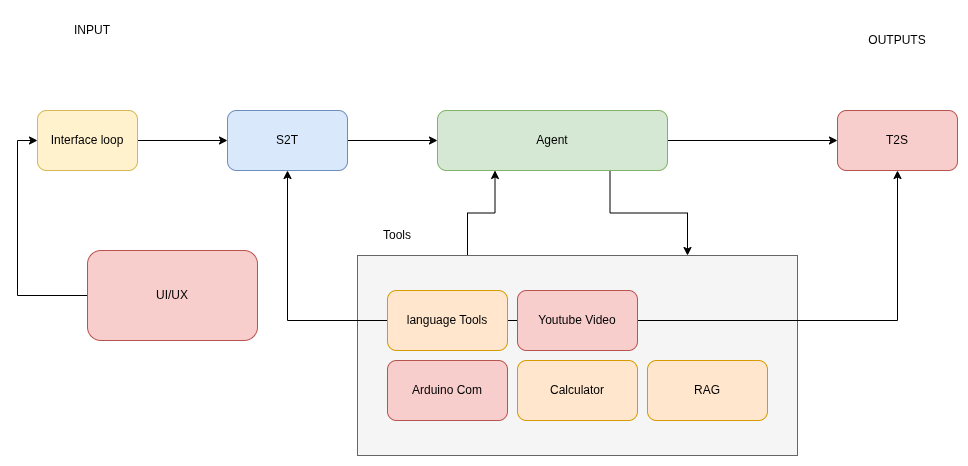

## Ruby Overview 

**Ruby** is an advanced voice-activated AI assistant capable of multilingual communication, executing complex tasks, and interacting through a visual user interface. Built with **LangChain**, **OpenAI**, and **Google Cloud Services**, Ruby allows for natural voice conversations and provides feedback via a dynamic Pygame-based GUI.

### Key Features
- **Voice Interaction**: Real-time Speech-to-Text (STT) and Text-to-Speech (TTS) powered by Google Cloud.
- **Multilingual Support**: Supports English (India), Malayalam, and Tamil.
- **Visual Interface**: A responsive GUI that visualizes the assistant's state (Listening, Thinking, Speaking, Idle).
- **Tool Integration**:
  - **YouTube Player**: Search and play videos directly.
  - **Calculator**: Perform mathematical calculations.
  - **Document Querying**: Ask questions about loaded documents.
  - **Arduino Control**: Communicate with hardware via serial.

### System Architecture


Ruby operates on a modular architecture where a central mainframe orchestrates interactions between the user, the AI model (LangChain/OpenAI), and various peripheral tools. The system integrates real-time speech processing (Google Cloud STT/TTS) with a visual frontend (Pygame) to create a seamless, interactive experience. For a deeper dive, check out the [System Architecture Diagram](system_architecture.md).

## Setup Guide 

### Prerequisites
- **Python 3.12+**
- **uv** package manager (recommended) or pip.
- **Google Cloud Account**: with "Cloud Speech-to-Text API" and "Cloud Text-to-Speech API" enabled.
- **OpenAI API Key**: for the language model.

### Installation

1.  **Clone the Repository**
    ```bash
    git clone <repository-url>
    cd rubybot
    ```

2.  **Install Dependencies**
    install requirements.txt:
    ```bash
    pip install -r requirements.txt
    ```
    
    setup project environment using uv (recommended):
    ```bash
    uv sync
    ```
3.  **Configure Environment Variables**
    Create a `.env` file in the root directory and add the following keys:
    ```ini
    OPENAI_API_KEY=your_openai_api_key_here
    GOOGLE_APPLICATION_CREDENTIALS=/path/to/your/google_credentials.json
    ```
    *Note: Ensure you have the Google Cloud JSON key file saved locally and referenced correctly.*

## Usage Guide 

### Running the Application
You can start Ruby using the provided script or directly via `uv`:

**Using the script:**
```bash
./run.sh
```

**Using uv:**
```bash
uv run frontend/app.py
```

### Interacting with Ruby
- **Voice Commands**: speak clearly to the microphone. Ruby will listen, process your request, and respond verbally.
- **Visual Feedback**:
  - **Blue**: Listening
  - **White**: Thinking
  - **Red**: Speaking
  - **Grey**: Idle
- **Stop Speech**: Click anywhere on the application window to immediately stop Ruby from speaking.
